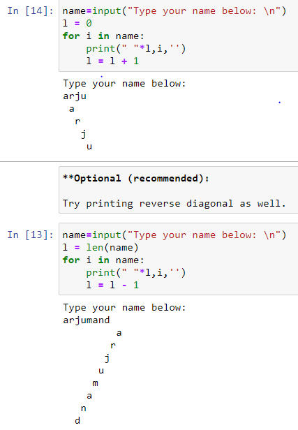
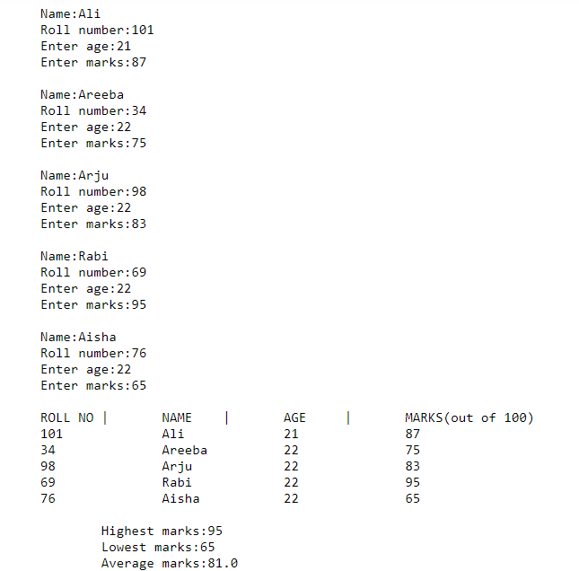
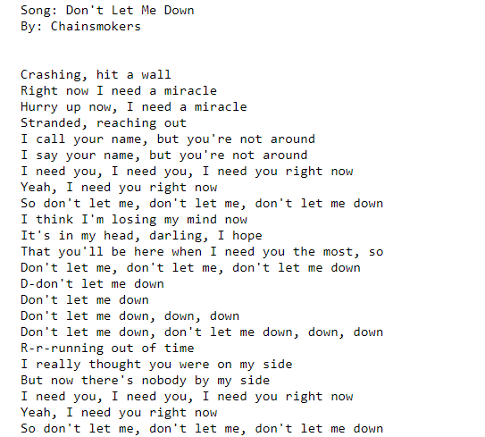

# DSC-DSU | Python Bootcamp 2020 | Week 1

# **Assignment 01**
## Question 01
Define a function to print a string diagonally, for example:

   Tarun will be printed as:

  ```sh
T
 a
  r
   u
    n
```
Optional (recommended):

- Try printing reverse diagonal as well.

<br>
In this task, i create a program which takes an string [name] as an input and then in a loop string breaks and print diagonally. here is the output

<p align="center"></img></p>

## Question 02.
Create a program to take as input 5 student records in the following format:

```
**roll_num** | **name** | **age** | **marks**(out of 100)
```

And then output the records in a tabular form with class average, class highest and class lowest at end in the following format.

- Use dictionaries (list of dictionaries in exact)
- Insert atleast 5 records
- Input must be user-given
- (Optional) validate the user input, i.e marks aren't greater 100 and other such validations you think there might be

<br>
<br>
Here is the output:
<p align="center"></img></p>

## Question 03. 
A function that will print lyrics of given song with 1 second delay between each line.

   - Use time.sleep()
   - Use split() function of string

Here is the output:
<p align="center"></img></p>
